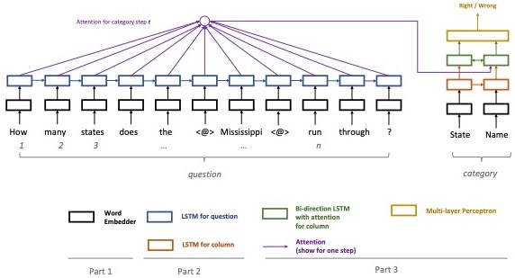

[SpatialNLI](./README.md) | Spatial Comprehension | [Annotation](./README.anno.md)

# SpatialNLI using Spatial-Comprehension
Understanding Spatial Semantics based on context. (e.g., understand the type of a Point-of-Interest)

## Challenge
 | Context | Spatial Semantics |
 |---------|:-------------------:|
 |  | The meaning of Spatial phrase `Mississippi` |
 | How many people live in `Mississippi` ?| State |
 | How many states does the `Mississippi` run through ?| River |
 |  |  The meaning of Spatial phrase `Over`  |
 | How many people walked `over` the bridge? | On |
 | How many birds flew `over` the bridge?    | Above|
 | | The meaning of spatial phrase `at the back of`  |
 | How many trees are `at the back of` the building? | Exterior |
 | How many rooms are `at the back of` the building? | Interior |
  
   
## Approach
  Using a bi-directional attention flow to resolve ambiguity by understanding the spatial context.
  

## Usage

Directory

```SpatialNLI/utils/annotate/bc```

To build data

```embed.py```

To train a new model

```python word_classifier.py --mode train```

To use trained model for evaluating test sets

```python word_classifier.py --mode infer```

To use trained model to infer a question

For example, "How many rivers are found in `colorado` ?", to infer whether `coloado` refers to a `city`, `state`, or `river`.

    ls = ['how many rivers are found in <f0> colorado <eof>\tcity', 'how many rivers are found in <f0> colorado <eof>\tstate', 'how many rivers are found in <f0> colorado <eof>\triver'] 
    tf_model = TF()
    g = glove.Glove()
    flag, prob = tf_model.infer(ls, g)
    ---------------------------------
    OUTPUT: flag = 'state'
            prob = [.1, .9, .1]
    
   

## Performance
 
  Acc<sub>rcd</sub> is record accuracy. *It is the acc that optimized by spatial comprehension model.*
  
  Acc<sub>qu</sub> is question accuracy. *It is the acc that we would like to improve.*
  
  |Data Split|         | Train | Test|
  |----------|---------|-------|-----|
  |Geoquery  | Acc<sub>rcd</sub> |97.4%  |91.9%|
  |Geoquery  | Acc<sub>qu</sub> |98.3%  |[**98.1%**](https://drive.google.com/drive/folders/1-9jByLW3_zmpgUjeYaCSfuf-t36foL1i)|
  |Restaurant| Acc<sub>rcd</sub> |100%   |100% |
  |Restaurant| Acc<sub>qu</sub> |100%   |[**100%**](https://drive.google.com/drive/folders/1oG37fIyKIZ26-ht12xR1Ll3TzrGNFy-z?usp=sharing)|
  

<!---Training with multiple datasets using a single model
|              |Acc<sub>qm</sub>|Acc<sub>qm</sub>|
|--------------|----------------|----------------|
| Model        |Geoquery        |Restaurant      |
| Separate     | 90.4%          |100%            |
| Shared       |**90.7%**       |**100%**        |
--->

  
## Miscellaneous

  Make sure the size of the test set is divisible by batch_size while evaluation.


  
